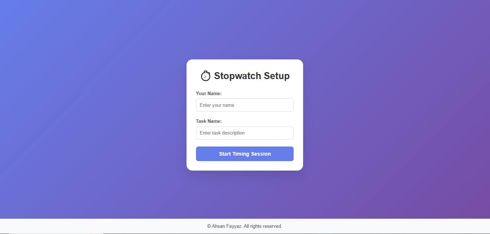

# ⏱️ Stopwatch Timer

A clean, responsive stopwatch web application with lap tracking, keyboard shortcuts, and export functionality built with vanilla HTML/CSS/JavaScript.

## 🖼️ Screenshot



## ✨ Features

- **Real-time precision timing** - Updates every 10ms for accurate time tracking
- **User & task session tracking** - Personalize your timing sessions
- **Lap time recording** - Track multiple intervals within a session
- **Keyboard shortcuts** for enhanced accessibility:
  - `Space` - Start/Stop timer
  - `R` - Reset timer
  - `L` - Add lap time
- **Export functionality** - Save lap data as text file for analysis
- **Fully responsive design** - Works seamlessly on desktop and mobile
- **Modern UI/UX** - Clean interface with smooth animations

## 🚀 Getting Started

1. Clone the repository:
   ```bash
   git clone https://github.com/yourusername/stopwatch-timer.git
   ```

2. Navigate to the project directory:
   ```bash
   cd stopwatch-timer
   ```

3. Open `index.html` in your web browser or serve it using a local server:
   ```bash
   # Using Python 3
   python -m http.server 8000
   
   # Using Node.js (http-server)
   npx http-server
   ```

4. Visit `http://localhost:8000` in your browser

## 📁 Project Structure

```
stopwatch-timer/
├── index.html      # Main HTML structure
├── style.css       # All styling and animations
├── script.js       # JavaScript functionality
├── screenshot.png  # Project screenshot
└── README.md       # Project documentation
```

## 🎯 Usage

1. **Setup**: Enter your name and task description
2. **Start Timing**: Click "Start Timing Session" or use the `Space` key
3. **Control Timer**: Use buttons or keyboard shortcuts
4. **Track Laps**: Press `L` or click "Lap" to record intervals
5. **Export Data**: Click "Export Laps" to save your session data

## 🛠️ Technologies Used

- **HTML5** - Semantic markup structure
- **CSS3** - Modern styling with flexbox, gradients, and animations
- **Vanilla JavaScript** - No frameworks, pure ES6+ features
- **Web APIs** - File download, local storage, and timing functions

## 🎨 Design Features

- Purple gradient background with glassmorphism effects
- Hover animations and smooth transitions
- Accessible color contrast and typography
- Mobile-first responsive design
- Clean, minimalist interface

## ⌨️ Keyboard Shortcuts

| Key | Action |
|-----|--------|
| `Space` | Start/Stop timer |
| `R` | Reset timer |
| `L` | Add lap time |
| `Enter` | Submit setup form |

## 📊 Export Format

Exported lap files include:
- User name and task description
- Session date and time
- Detailed lap times in readable format

Example:
```
Name: Ahsan Fayyaz
Task: Morning Workout
Date: 7/20/2025, 10:30:00 AM

Lap Times:
Lap 1: 00:01:23.45
Lap 2: 00:02:48.12
Lap 3: 00:04:15.78
```

## 🤝 Contributing

Contributions are welcome! Please feel free to submit a Pull Request. For major changes, please open an issue first to discuss what you would like to change.

1. Fork the project
2. Create your feature branch (`git checkout -b feature/AmazingFeature`)
3. Commit your changes (`git commit -m 'Add some AmazingFeature'`)
4. Push to the branch (`git push origin feature/AmazingFeature`)
5. Open a Pull Request


## 👨‍💻 Author

**Ahsan Fayyaz**

- 💼 LinkedIn: [Connect with me on LinkedIn](https://www.linkedin.com/in/ahsan-fayyaz/)

---

⭐ If you found this project helpful, please give it a star!

## 🎯 Future Enhancements

- [ ] Dark/Light theme toggle
- [ ] Sound notifications for lap times
- [ ] Multiple timer sessions
- [ ] Advanced statistics and charts
- [ ] Cloud sync for session data
- [ ] Mobile app version

---

*Made with ❤️ by Ahsan Fayyaz*
